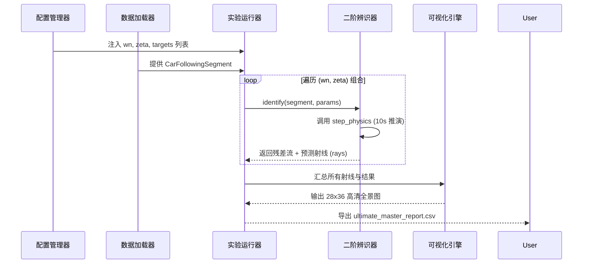

# 系统架构设计

DriveStyle V14.0 采用高度抽象的模块化架构，旨在为大规模跟车数据提供具备 **“物理强一致性”** 的研判环境。

## 🏗️ 分层模型深度解剖

### 1. 配置层 (Configuration Layer)
通过单例模式的 `ConfigManager` 统一管理所有的外部配置。
- **价值**：杜绝了代码中的“魔法数字”，支持实验人员在不触碰核心逻辑的情况下调节 $\omega_n, \zeta$ 等超参数。
- **文件**：`config/default_config.yaml` | [config_manager.py](file://src/core/config_manager.py)

### 2. 领域层 (Domain Layer)
定义了系统的核心语义：`Vehicle` (车辆) 与 `CarFollowingSegment` (跟车片段)。
- **物理契约**：所有算法均以 `CarFollowingSegment` 为标准输入，确保了数据格式的无关性（CSV 或 JSON 均可）。
- **文件**：[models.py](file://src/domain/models.py)

### 3. 辨识算法层 (Identification Layer)
实现二阶微分方程的数值解法。
- **原子化计算**：将复杂的微分方程离散化为 `step_physics` 方法。
- **策略模式**：继承自 `BaseIdentifier` 接口，支持未来扩展（如 RL 辨识器）。
- **文件**：[second_order_id.py](file://src/identification/second_order_id.py)

### 4. 应用服务层 (Application/Service Layer)
负责跨模块协作。
- **ExperimentRunner**：自动化流水线，负责循环调用辨识器、收集统计数据并驱动可视化。
- **文件**：[run_param_sweep.py](file://scripts/run_param_sweep.py)

## 🔄 核心数据流

## 🏗️ 核心设计模式

| 模式 | 应用位置 | 作用 |
|------|----------|------|
| **单例模式 (Singleton)** | `ConfigManager` | 确保全局配置唯一，避免内存冗余。 |
| **策略模式 (Strategy)** | `BaseIdentifier` | 算法可插拔，方便对比不同阶数的物理模型。 |
| **组合模式 (Composition)** | `MatplotlibVisualizer` | 全景报告由多个独立的 Panel 组合而成。 |
| **工厂模式 (Factory)** | `DataLoaderFactory` | 屏蔽了 CSV/JSON 解析差异。 |

---

**章节参考源**
- [src/core/config_manager.py](file://src/core/config_manager.py)
- [scripts/run_param_sweep.py](file://scripts/run_param_sweep.py)

*由 [Mini-Wiki v3.0.6](https://github.com/trsoliu/mini-wiki) 自动生成 | 2026-03-14*
