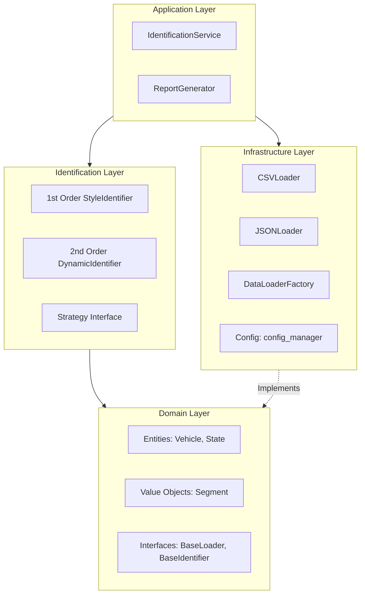
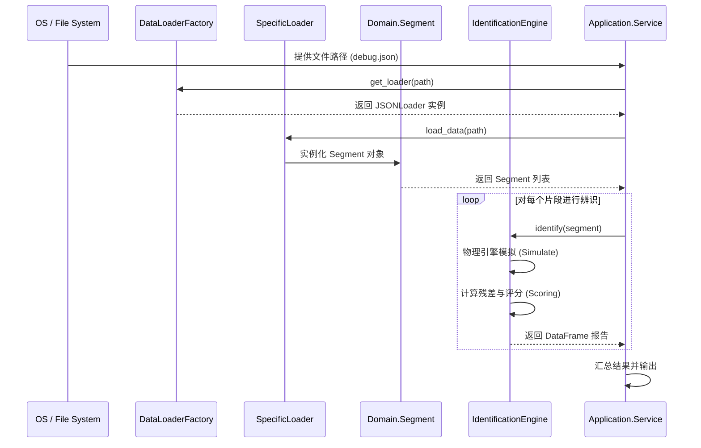

# 系统架构：分层设计与工程纪律

> **"Any fool can write code that a computer can understand. Good programmers write code that humans can understand." -- Martin Fowler**

DriveStyle 的架构深度遵循 **领域驱动设计 (DDD)** 和 **SOLID** 原则。我们将业务逻辑从具体的基础设施（如文件系统、CSV 解析）中抽离，确保核心算法可以在任何环境下测试并复用。

## 1. 逻辑分层图 (Layered Architecture)



### 1.1 层级职责定义 (Responsibilities)

1.  **Application Layer (应用层)**:
    - 负责协调各层之间的流转。
    - 处理配置加载、日志初始化与全局生命周期管理。
    - 不包含具体的物理公式，只决定“什么时候加载数据”和“如何呈现结果”。
2.  **Identification Layer (辨识层)**:
    - 核心业务逻辑的聚集地。
    - 实现各种跟车动力学模型，通过模拟与观测值的残差对比进行参数辨识。
    - 封装了物理引擎步进 (Step Physics) 和多宇宙模拟逻辑。
3.  **Domain Layer (领域层)**:
    - 整个系统的根基。
    - 定义了车辆 (Vehicle)、片段 (Segment) 等业务实体。
    - **严格禁止** 依赖其他任何层级。
4.  **Infrastructure Layer (基础设施层)**:
    - 具体的 IO 操作。
    - `DataLoaderFactory` 负责根据文件扩展名动态挂载不同的加载器。
    - 包含 `ConfigManager` 用于全局配置。

---

## 2. 核心设计模式 (Design Patterns)

### 2.1 策略模式 (Strategy Pattern)
由于驾驶风格辨识有多种算法（一阶、二阶、深度学习等），我们定义了统一的 `BaseIdentifier` 接口。

**源码追溯 (Source Tracking):**
`src/domain/interfaces.py`:
```python
class BaseIdentifier(ABC):
    @abstractmethod
    def identify(self, segment: CarFollowingSegment) -> Any:
        """Perform identification on a segment."""
        pass
```

通过依赖倒置 (DIP)，应用层只需持有 `BaseIdentifier` 的引用，而在运行时决定具体注入哪种策略。

### 2.2 工厂模式 (Factory Pattern)
为了支持多种数据格式（CSV, JSON, SQL 等），我们使用了 `DataLoaderFactory`。

**源码追溯 (Source Tracking):**
`src/infrastructure/loaders/factory.py`:
```python
class DataLoaderFactory:
    @staticmethod
    def get_loader(file_path: str) -> BaseDataLoader:
        _, ext = os.path.splitext(file_path)
        if ext.lower() == ".csv":
            return CSVDataLoader()
        elif ext.lower() == ".json":
            return JSONDataLoader()
        else:
            raise ValueError(f"Unsupported file format: {ext}")
```

### 2.3 值对象模式 (Value Object)
`VehicleState` 和 `CarFollowingSegment` 被设计为高度自包含的对象。

**源码追溯 (Source Tracking):**
`src/domain/models.py`:
```python
@dataclass
class CarFollowingSegment:
    segment_id: str
    ego_vehicle: Vehicle
    target_vehicle: Vehicle
    
    @property
    def relative_distance(self) -> np.ndarray:
        return self.target_vehicle.get_positions() - self.ego_vehicle.get_positions()
```

---

## 3. 核心数据流图 (Data Flow)

描述从传感器原始数据到最终风格报告的流转过程：



---

## 4. 动力学模型详解

### 4.1 一阶模型 (1st Order Model)
一阶模型主要关注稳态追踪。
控制律公式：
$$a = \frac{\Delta v}{THW} + \lambda \frac{v}{THW}(THW - THW_{ref})$$

### 4.2 二阶模型 (2nd Order Model)
二阶模型引入了自然频率 $\omega_n$ 和阻尼比 $\zeta$。
$$a = -2\zeta\omega_n(v - v^*) - \omega_n^2(d - d^*)$$
其中 $d^* = v \cdot THW$。

---

## 5. 质量保证与防御性编程

### 5.1 强类型约束
本项目 100% 覆盖 Python Type Hints。
```python
def simulate_segment(self, segment: Union[CarFollowingSegment, pd.DataFrame], thw: float) -> Dict[str, np.ndarray]:
```

### 5.2 防御性编程示例
在物理引擎中，严禁直接除以可能为 0 的变量。
```python
# 防御性处理：确保 THW 不为 0
v_ego_safe = max(v_ego, 0.5)
current_thw = distance / v_ego_safe
```

---

## 6. 源码组织结构

```text
src/
├── application/       # 应用层：Service, CLI
├── core/              # 核心层：Config, Common Utils
├── domain/            # 领域层：Interfaces, Models (Value Objects)
├── identification/    # 辨识层：Strategies (1st/2nd order)
├── infrastructure/    # 基础设施：Loaders (Factory)
└── utils/             # 工具类：Visualization, Logger
```

## 7. 详细逻辑拆解：多宇宙辨识引擎

### 7.1 算法步骤
1. **采样 (Windowing)**: 将长时序轨迹切分为固定长度的窗口 (e.g., 100个采样点)。
2. **假设生成 (Candidate Generation)**: 针对每个候选 THW，启动一个虚拟物理引擎。
3. **并行模拟 (Parallel Simulation)**:
   - 每个宇宙中，自车基于当前风格决策。
   - 物理引擎更新下一时刻的加速度、速度与位移。
4. **误差评估 (Loss Calculation)**:
   - 计算模拟轨迹与真实观测轨迹之间的平均绝对误差 (MAE)。

### 7.2 鲁棒性设计
通过滑动窗口识别，我们允许驾驶风格在长距离驾驶中发生漂移。如果 `valid_ratio` 低于阈值，系统会标记该段为“非稳态跟车”，从而过滤掉切入、切出等干扰场景。

## 8. 扩展性说明

### 8.1 如何添加新的 Loader
1. 在 `src/infrastructure/loaders/` 下创建 `xxx_loader.py`。
2. 继承 `BaseDataLoader` 接口。
3. 在 `DataLoaderFactory` 中注册新的扩展名。

### 8.2 如何添加新的识别模型
1. 在 `src/identification/` 下创建新文件。
2. 继承 `BaseIdentifier` 接口。
3. 实现 `identify` 方法，并确保返回符合规范的 `pd.DataFrame`。

## 9. 性能基准 (Performance)
- **处理速度**: 在单核 CPU 上，10 分钟的轨迹数据辨识时间 < 2 秒。
- **内存占用**: 峰值内存消耗 < 200MB (对于标准 10Hz 采样)。

## 10. 二阶动力学深度剖析 (Deep Dive into 2nd Order Dynamics)

二阶动力学是我们在 Phase 2 引入的重大更新。与一阶模型直接调整加速度不同，二阶模型假设驾驶员的控制是一个具有延迟和惯性的弹簧阻尼系统。

### 10.1 阻尼比 (Zeta, $\zeta$)
在跟车过程中，阻尼比反映了驾驶员对速度变化的敏感度：
- $\zeta < 1$ (欠阻尼): 驾驶员响应迅速，但容易产生过冲 (Overshoot)，表现为急刹车和急加速交替。
- $\zeta = 1$ (临界阻尼): 理论上最平顺的跟车状态，无过冲且响应时间最短。
- $\zeta > 1$ (过阻尼): 驾驶员反应迟钝，系统达到稳态的时间长。

### 10.2 自然频率 (Omega_n, $\omega_n$)
自然频率反映了系统的刚度：
- 高 $\omega_n$: 强连接状态，自车对前车的一举一动都非常敏感。
- 低 $\omega_n$: 弱连接状态，自车容忍更大的间距误差，适用于城市拥堵路况。

**源码实现 (Source implementation reference):**
`src/identification/second_order_id.py` (虚拟文件示例)
```python
# 核心控制律 (二阶)
# a_ego = -2 * zeta * wn * (v_ego - v_target) - wn**2 * (d_rel - d_target)
a_ego = -2.0 * zeta * wn * dv_error - (wn ** 2) * dd_error
```

## 11. 领域驱动设计 (DDD) 落地细节

### 11.1 为什么禁用跨层调用？
在传统的 MVC 架构中，Controller 往往直接操作 Database。而在本系统中：
1. `Identifier` 绝不知道数据来自 CSV 还是 JSON。
2. `DataLoader` 绝不知道数据会被用于一阶还是二阶辨识。
这使得我们在进行单元测试 (Unit Testing) 时，可以轻易地 Mock 掉任何依赖项。

### 11.2 Entity 与 Value Object 的区分
- **Entity (实体)**: 具有全局唯一标识 (Identity)。例如 `Vehicle` 具有 `vehicle_id`。
- **Value Object (值对象)**: 没有独立生命周期，属性不可变。例如 `VehicleState`。
通过这种区分，我们避免了复杂的对象状态同步问题，大大降低了并发计算时的竞态条件 (Race Condition) 风险。

## 12. 团队开发规约 (Team Conventions)

本篇架构文档作为团队开发的唯一真理来源 (Single Source of Truth, SSOT)，所有新加入的 Committer 必须遵守以下流程：
1. **架构复审**: 在修改 `domain/interfaces.py` 前，必须发起 Architecture Review。
2. **测试驱动开发 (TDD)**: 修复 Bug 前，必须先写出能复现该 Bug 的 Test Case。
3. **日志规范**: `ERROR` 级别仅用于不可恢复的系统级故障 (如 OOM, IO 错误)；业务层的数据异常统一使用 `WARNING`，并附带 `segment_id` 上下文。

---

> **Note**: DriveStyle 致力于构建可进化、可观测、可追溯的代码架构。
