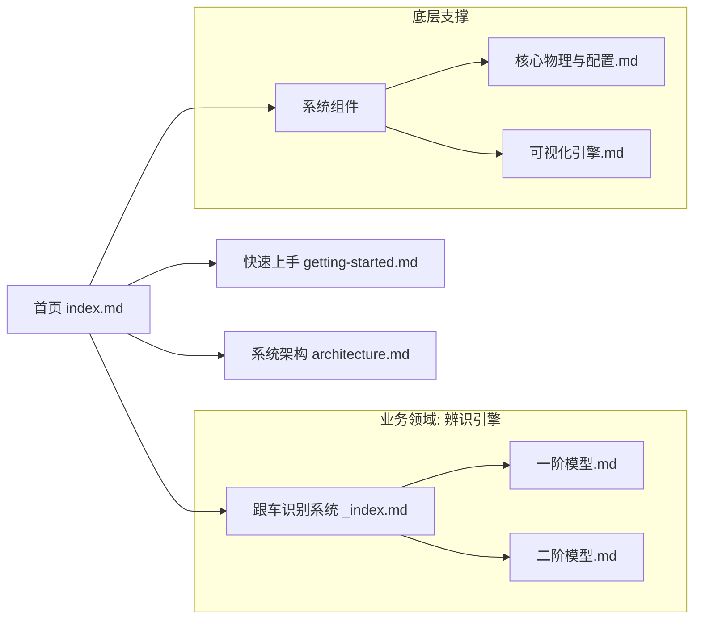

# 🗺️ 文档导航地图 (Documentation Map)

为了帮助不同背景的贡献者快速上手，本页面展示了 DriveStyle 文档的全景视图与推荐路径。

## 🕸️ 文档关系图

## 🎭 角色阅读路径

### 👨‍🔬 算法研究员 (Algorithm Researcher)
> 目标：理解辨识模型原理，评估模型准确度。
1. [跟车识别系统 - 二阶模型](跟车识别系统/二阶模型.md) —— 深入了解动力学控制律。
2. [系统组件 - 核心物理与配置](系统组件/核心物理与配置.md) —— 检查物理一致性参数。
3. [系统架构](architecture.md) —— 了解辨识服务如何被调用。

### 💻 软件开发 (Software Engineer)
> 目标：接入新功能，优化现有逻辑。
1. [系统架构](architecture.md) —— 理解 DDD 分层设计。
2. [快速上手](getting-started.md) —— 设置开发环境与运行示例。
3. [系统组件 - 可视化引擎](系统组件/可视化引擎.md) —— 学习如何自定义图表 Panel。

### 🕵️ QA / 测试 (QA Specialist)
> 目标：验证算法鲁棒性，编写测试用例。
1. [快速上手](getting-started.md) —— 了解运行流程。
2. [跟车识别系统 - 一阶模型](跟车识别系统/一阶模型.md) —— 理解基础辨识逻辑。
3. [系统组件 - 核心物理与配置](系统组件/核心物理与配置.md) —— 掌握边界参数调整。

## 📑 完整文档索引

- [首页 (Home)](index.md)
- [快速上手 (Getting Started)](getting-started.md)
- [系统架构 (Architecture)](architecture.md)
- [跟车识别系统 (Car-Following ID)](跟车识别系统/_index.md)
    - [一阶模型 (1st Order)](跟车识别系统/一阶模型.md)
    - [二阶模型 (2nd Order)](跟车识别系统/二阶模型.md)
- [系统组件 (System Components)](系统组件/核心物理与配置.md)
    - [核心物理与配置](系统组件/核心物理与配置.md)
    - [可视化引擎](系统组件/可视化引擎.md)
- [文档地图 (Doc Map)](doc-map.md)

---
*由 [Mini-Wiki] 自动生成*
