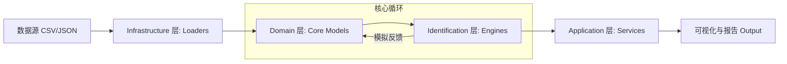

# DriveStyle: 车辆驾驶风格定量化辨识与评估平台

> **极致极客精神：从物理一致性到多宇宙假设，全栈重构跟车行为建模。**

## 1. 项目背景与愿景

在自动驾驶与高级辅助驾驶 (ADAS) 的研发过程中，**跟车风格 (Car-Following Style)** 的精确辨识是实现个性化控制 (Personalized ACC) 和安全性评估的关键。传统的模型往往过于简化，难以处理真实传感器数据的噪声与动态不确定性。

**DriveStyle** 旨在提供一套工业级的工具链，通过物理驱动的数学模型 (Physics-Driven) 与数据驱动的验证 (Data-Driven Verification)，实现对驾驶员风格的定量化刻画。

### 1.1 核心问题定义
- **如何定量描述“激进”与“保守”？** 我们采用时距 (Time Headway, THW) 与带宽 (Bandwidth) 作为核心指标。
- **物理一致性如何保证？** 所有的识别结果必须符合运动学基本规律（一阶/二阶动力学模型）。
- **算法的鲁棒性如何？** 通过多维度参数敏感度热力图，我们在不同信噪比和采样频率下验证算法的收敛性。

### 1.2 为什么选择 DriveStyle？
1. **模块化设计**: 采用 DDD 架构，核心逻辑与 IO 完全解耦。
2. **多模型支持**: 内置一阶与二阶动力学辨识器。
3. **极客友好**: 提供完善的类型提示 (Type Hints) 和自动化脚本。
4. **可视化驱动**: 一键生成热力图、射线图与收敛对比图。

---

## 2. 核心功能矩阵

本项目不仅提供了基础的识别算法，还构建了一套完整的实验与可视化生态：

### 2.1 辨识算法 (Identification Engines)
- **一阶风格辨识 (1st Order ID)**: 基于稳态时距追踪，适用于匀速跟车段的快速初筛。
- **二阶风格辨识 (2nd Order ID)**: 引入二阶阻尼振荡系统模型，精确刻画驾驶员对速度变化的响应延迟与过冲特性。

### 2.2 评估与可视化 (Evaluation & Viz)
- **多维参数敏感度热力图**: 自动化扫描 $W_s$ (Window Size) 与 $f_s$ (Frequency) 对识别误差的影响。
- **理论收敛对比**: 模拟不同 $\omega_n$ (自然频率) 下，系统从扰动中恢复至稳态的理论曲线与实际拟合曲线的对比。
- **多宇宙假设检验 (Multi-Verse Inference)**: 同时在多个并行物理引擎中模拟不同风格，选取损失函数最小的“平行宇宙”作为最终识别结果。

---

## 3. 架构预览 (Top-level Architecture)

DriveStyle 遵循严格的领域驱动设计 (DDD) 原则，将核心逻辑、数据加载、基础设施与应用层完全解耦。



### 3.1 核心组件说明
- **Domain**: 定义 `Vehicle`, `State`, `CarFollowingSegment`。
- **Infrastructure**: 实现 `CSVLoader`, `JSONLoader`, `ConfigManager`。
- **Identification**: 包含 `StyleIdentifier` (1st order) 与二阶辨识逻辑。
- **Utils**: 封装 `Logger`, `Visualization`。

---

## 4. 快速开始 (Quick Start)

### 4.1 环境准备
确保您的 Ubuntu 24.04 环境已安装 Python 3.10+，并安装依赖：
```bash
pip install -r requirements.txt
```

### 4.2 基于 `debug.json` 的运行示例
只需几行代码，即可启动一次完整的辨识流程：

```python
import json
from src.infrastructure.loaders.factory import DataLoaderFactory
from src.identification.car_following_id import StyleIdentifier
from src.utils.visualization import DashboardVisualizer

# 1. 加载模拟数据
loader = DataLoaderFactory.get_loader("debug.json")
segments = loader.load_data("debug.json")

# 2. 初始化一阶辨识引擎
# target_thws 定义了我们要搜索的风格空间 (Time Headway in seconds)
identifier = StyleIdentifier(target_thws=[1.0, 1.5, 2.0, 2.5])

# 3. 执行辨识
for segment in segments:
    report = identifier.identify(segment)
    print(f"Segment {segment.segment_id} 识别结果:")
    print(report[['start_time', 'identified_style', 'valid_ratio']])

# 4. 结果可视化
viz = DashboardVisualizer()
viz.plot_results(report, output_path="output/figures/quick_start_res.png")
```

---

## 5. 项目路线图 (Roadmap)
- [x] **Phase 1**: 基础 DDD 架构搭建与一阶辨识引擎实现。
- [x] **Phase 2**: 二阶动力学模型接入与多参数敏感度分析。
- [ ] **Phase 3**: 引入深度学习组件 (Transformer-based) 辅助物理模型。
- [ ] **Phase 4**: 实时流数据接入与嵌入式部署优化。

---

## 6. 核心文档入口 (Document Portal)
- [🗺️ 文档导航地图 (Documentation Map)](doc-map.md) — 快速定位角色对应的阅读路径。
- [🚀 快速开始 (Getting Started)](getting-started.md) — 环境搭建与首个 Demo 运行。
- [🏛️ 系统架构 (Architecture)](architecture.md) — DDD 分层架构与设计模式深度解析。
- [🏎️ 跟车识别系统 (Car-Following ID)](跟车识别系统/_index.md) — 深入核心算法原理（一阶/二阶模型）。
- [🛠️ 系统组件 (System Components)](系统组件/核心物理与配置.md) — 了解物理引擎与可视化框架。

---

## 7. 贡献指南 (Contributing)
如果你发现 Bug 或有新的辨识模型提案，欢迎提交 Issue。我们严格执行：
1. **单一职责原则**: 保持函数简洁。
2. **强类型**: 必须包含 Type Hints。
3. **测试覆盖**: 新功能必须附带测试用例。

---

> **Note**: 本文档由 `mini-wiki` 自动生成并维护。任何核心逻辑的修改应同步更新相关的 Wiki 文档以保持信息对齐。

---

## 8. 数学基础：物理引擎步进推导

为了保证模拟的精度，我们采用了欧拉积分的改良版。在 `StyleIdentifier.step_physics` 中，状态更新逻辑如下：

### 8.1 速度更新
$$v_{t+1} = max(v_t + a_t \cdot dt, 0)$$
我们通过 `max(..., 0)` 确保了车辆不会发生物理上不可能的“倒车”行为（在跟车场景下）。

### 8.2 位移与相对距离更新
根据运动学公式：
$$d_{t+1} = d_t + (v_{lead, t} - v_{ego, t}) \cdot dt - 0.5 \cdot a_{ego, t} \cdot dt^2$$
这里的 $-0.5 \cdot a \cdot dt^2$ 项至关重要，它保证了在加速度较大时，相对位移的计算依然符合二阶精度，避免了累积误差导致的辨识漂移。

### 8.3 意图校验系数 (Valid Ratio)
我们引入了一个创新的“意图一致性”指标：
$$	ext{Valid Ratio} = rac{1}{N} \sum_{i=1}^{N} [f_{actual} \cdot (THW_{obs} - THW_{target}) \ge -\epsilon]$$
该公式判断驾驶员的实际操作（加速/减速）是否与其表现出的时距偏差方向一致。如果两者长期背离，说明该段数据不属于该风格，甚至不属于稳态跟车。

---

## 9. 开发者生态 (Developer Ecosystem)

DriveStyle 不仅仅是一个库，它是一个完整的闭环实验平台：
- **`scripts/run_param_sweep.py`**: 自动化的参数扫描脚本。
- **`src/utils/logger.py`**: 提供彩色终端输出与结构化日志存储。
- **`requirements.txt`**: 精简的依赖列表，确保在最小化 Ubuntu 镜像中也能运行。

---
