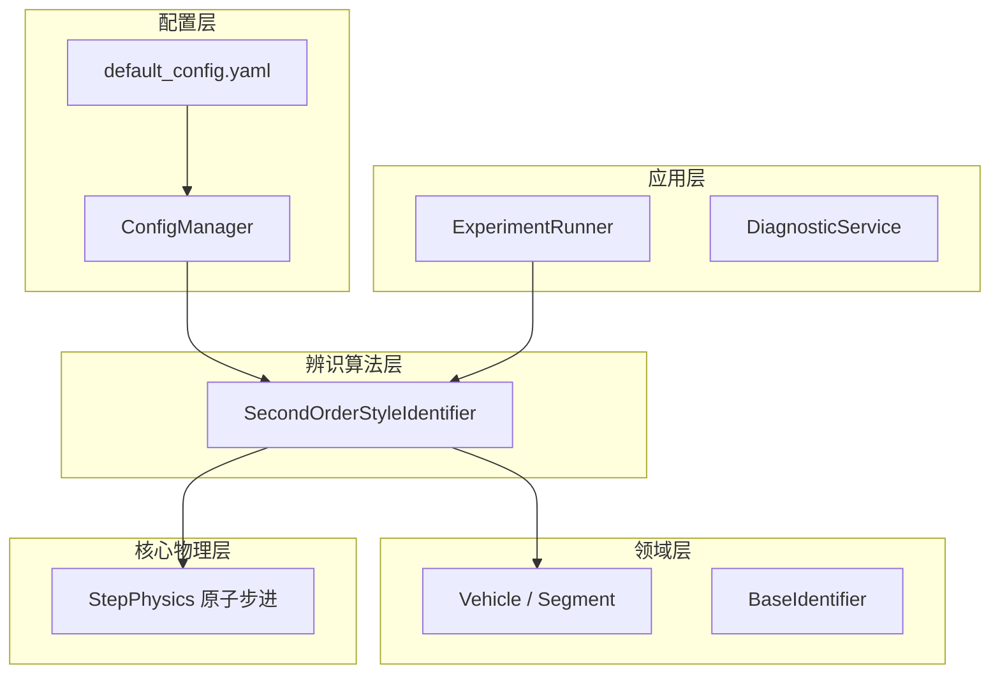

# DriveStyle 项目维基

欢迎使用 **DriveStyle** 旗舰版驾驶风格研判系统 (V14.0)。本项目是一个高度工程化的、基于物理信息的自动驾驶数据研判框架。

> **核心价值**：将复杂的交通流数据转化为可量化、可追溯的驾驶员“性格特征”资产。

## 🚀 研判看板一览

本项目目前支持从 **“全局地形”** 到 **“微观推演”** 的全谱段研判：

| 看板类型 | 物理意义 | 应用场景 |
|----------|----------|---------|
| **敏感度热力图** | $MAE = f(\omega_n, \zeta)$ | 寻找最优参数区间，分析性格与误差的敏感度。 |
| **长程稳态射线** | $\text{THW}_{future} = \int \int a_{sim} dt$ | 验证算法意图的收敛性与物理自洽性。 |
| **加速度规划图** | $a_{sim}$ 滚动规划 | 剖析虚拟驾驶员的“脚法”细节。 |
| **量化评估主表** | SSE, SettleTime, JerkVar | 工业级指标审计与定性性格打标。 |

## 🏗️ 软件分层架构

系统采用 **领域驱动设计 (DDD)** 结合 **配置驱动 (Config-Driven)** 的分层模式：

## 📖 技术导航

- **[系统架构设计](./architecture.md)**：深入了解分层解耦与单例配置。
- **[核心物理与配置](./modules/core.md)**：物理步进的一致性保证与 YAML 字典。
- **[辨识算法深度解析](./modules/identification.md)**：二阶微分方程推导与 10s 稳态推演逻辑。
- **[可视化框架说明](./modules/visualization.md)**：28x36 高清全景画布的组件化实现。
- **[快速上手 SOP](./getting-started.md)**：从 `debug.json` 到量化报表的完整工作流。

---

*由 [Mini-Wiki v3.0.6](https://github.com/trsoliu/mini-wiki) 自动生成 | 2026-03-14*
