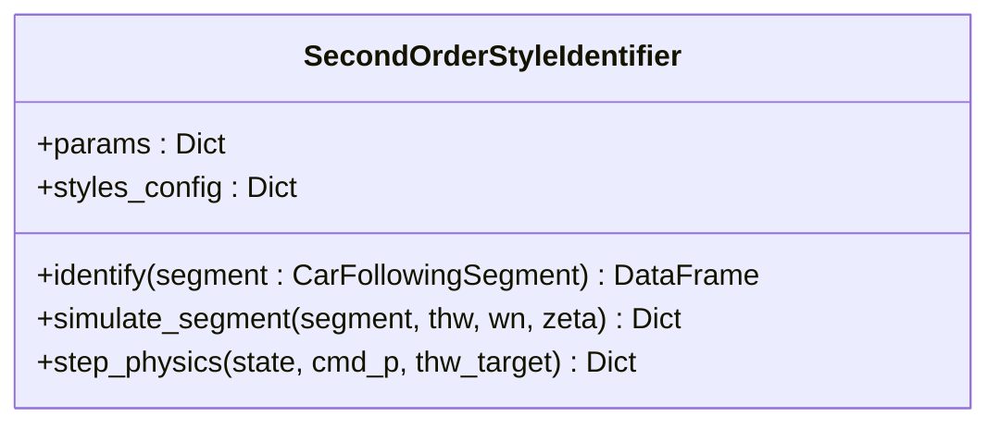

# 辨识算法深度解析

**辨识算法层 (Identification Layer)** 是 DriveStyle 的核心大脑。它通过 **基于物理驱动的多假设残差检验** 算法，逆向推演驾驶员的真实意图。

## 📐 二阶控制律数学推导

我们假设驾驶员的行为符合二阶阻尼振子系统。误差 $e$ 的衰减方程为：
$$\ddot{e} + 2\zeta\omega_n \dot{e} + \omega_n^2 e = 0$$

通过对空间误差 $e = \Delta x - THW \cdot v_{ego}$ 进行求导并代入，我们推导出自车加速度指令：
$$a_{cmd} = \alpha a_{lead} + K_v \Delta v + K_p e$$

其中关键系数：
-   $\alpha = 1 / (1 + 2\zeta\omega_n THW)$：前馈响应系数。
-   $\tau = THW \cdot \alpha$：系统一阶滞后时间常数。

## 🔄 10s 稳态长程推演逻辑

为了验证参数的物理合理性，系统引入了 **长程推演 (Spaghetti Plots)** 功能。

### 算法步骤
1.  **起始对齐**：从当前观测时刻 $t_0$ 的真实 $v, dist, a$ 出发。
2.  **预测外推**：如果未来数据缺失，假设前车保持最后的运动状态。
3.  **闭环积分**：
    -   每一帧根据当前规划的 $a_{sim}$ 更新自车状态。
    -   计算下一帧的误差并反馈至控制器。
4.  **收敛判定**：推演持续 10 秒，或直到误差进入 5% 的稳态带。

## 📦 `SecondOrderStyleIdentifier` 类

### 核心 API 说明 [📄](file://src/identification/second_order_id.py)
- **`identify`**: 核心辨识接口。输出包含 `rays` (THW 射线) 和 `acc_rays` (加速射线) 的 DataFrame。
- **`simulate_segment`**: 用于生成全局对比曲线。

---

**章节参考源**
- [src/identification/second_order_id.py](file://src/identification/second_order_id.py)

*由 [Mini-Wiki v3.0.6](https://github.com/trsoliu/mini-wiki) 自动生成 | 2026-03-14*
