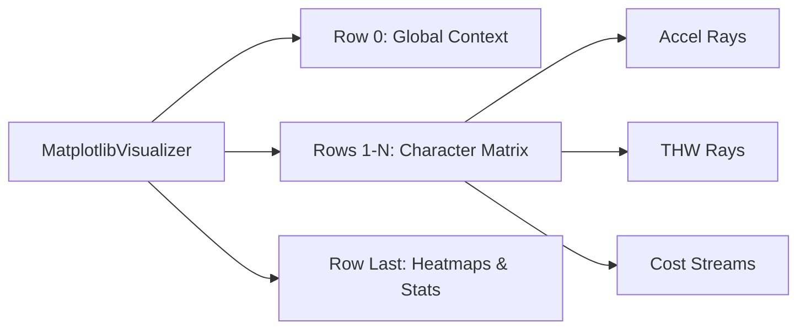

# 可视化框架说明

DriveStyle 拥有一套工业级的 **“算法研判墙”** 可视化引擎，旨在通过高密度的图表组合，揭示超参数与物理意图之间的复杂关系。

## 🎨 28x36 超融合看板设计

每一张 `ultimate_Ws_Xs.png` 报告都采用了组件化设计，包含 4 个核心 Panel 层级：

### 1. 🏆 全局动力学基准层 (Global Context)
- **内容**：自车/前车速度、实际加速度、$a_{lead}$ 参照线。
- **价值**：提供辨识的“物理第一现场”，判断工况是否具有辨识价值（如是否存在足够的动态激发）。

### 2. 🔍 响应性格对比矩阵层 (Character Comparison)
- **布局**：按 $\omega_n$ 分组，按 $\zeta$ 纵向展开。
- **组件 A (Accel Planning)**：展示未来 10s 的滚动规划加速度。
- **组件 B (THW Convergence)**：展示 10s 稳态预测射线。颜色（红/橙/绿）严格对齐目标风格。
- **组件 C (Cost Streams)**：线性展示 MAE 误差的实时演化。

### 3. ⚖️ 综合决策层 (Style Decisions)
- 将不同响应带宽 ($\omega_n$) 下的判定结果阶梯图合并，用于评估算法在不同参数下的抗噪性与响应时延。

### 4. 🔥 敏感度地形层 (Sensitivity Heatmap)
- 宏观展示 MAE 误差在 $THW \times \omega_n$ 空间的分布，锁定最优参数“洼地”。

## 🏗️ 可视化组件实现 [📄](file://src/utils/visualization.py)

---

**章节参考源**
- [src/utils/visualization.py](file://src/utils/visualization.py)

*由 [Mini-Wiki v3.0.6](https://github.com/trsoliu/mini-wiki) 自动生成 | 2026-03-14*
