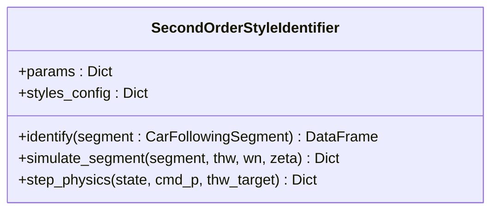

# 二阶跟车辨识模型 (2nd Order ID)

二阶模型引入了动力学响应滞后与阻尼特性，能够更精确地刻画驾驶员对速度变化的响应延迟与过冲特性。

## 📐 二阶控制律数学推导

我们假设驾驶员的行为符合二阶阻尼振子系统。误差 $ 的衰减方程为：
33048\ddot{e} + 2\zeta\omega_n \dot{e} + \omega_n^2 e = 033048

通过对空间误差  = \Delta x - THW \cdot v_{ego}$ 进行求导并代入，我们推导出自车加速度指令：
33048a_{cmd} = lpha a_{lead} + K_v \Delta v + K_p e33048

其中关键系数：
-   $lpha = 1 / (1 + 2\zeta\omega_n THW)$：前馈响应系数。
-   $	au = THW \cdot lpha$：系统一阶滞后时间常数。

## 📦 `SecondOrderStyleIdentifier` 类 [📄](file://src/identification/second_order_id.py)

### 核心 API 说明
- **`identify`**: 核心辨识接口。输出包含 `rays` (THW 射线) 和 `acc_rays` (加速射线) 的 DataFrame。
- **`simulate_segment`**: 用于生成全局对比曲线。

---
*由 [Mini-Wiki] 自动生成*
