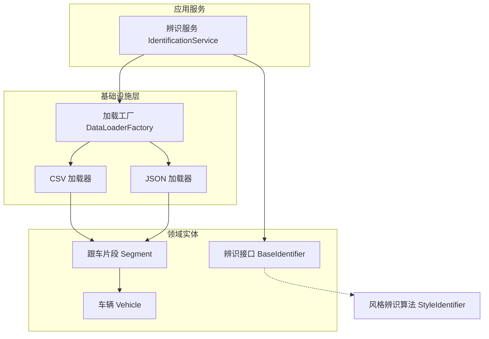
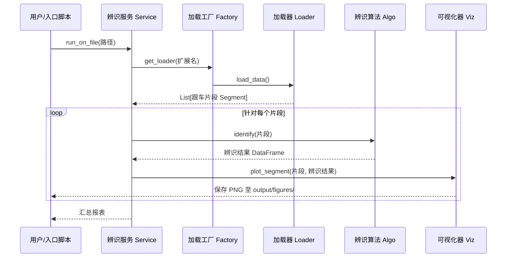

# 系统架构设计

**DriveStyle** 项目采用了模块化、领域驱动的架构设计，旨在解耦数据提取、算法辨识与结果呈现层。

## 🏗️ 分层架构概览

系统分为以下四个核心层级：

1.  **基础设施层 (Infrastructure)**: 负责数据 I/O。将异构数据格式（CSV, JSON 等）转换为统一的领域实体。
2.  **领域层 (Domain)**: 包含核心业务实体 (`Vehicle`, `CarFollowingSegment`) 及抽象接口。这是系统的“单一事实来源”。
3.  **应用层 (Application)**: 编排整个工作流。连接数据加载器、辨识器与可视化器。
4.  **算法辨识层 (Identification)**: 实现具体的物理基准驱动风格辨识算法。

## 🔄 核心工作流：从数据到决策

系统处理跟车数据的标准化管线如下：

## 📦 核心领域模型

### `Vehicle` (车辆实体)
记录单个车辆随时间变化的状态。存储带时间戳的坐标、速度与加速度。
- **源码参考**: [models.py](file://src/domain/models.py#L7)

### `CarFollowingSegment` (跟车片段)
分析的基本单元。封装了自车 (Ego) 与目标车 (Target) 组成的连续跟车事件。
- **关键属性**: `relative_distance` (相对距离), `relative_velocity` (相对速度), `duration` (持续时长)。
- **源码参考**: [models.py](file://src/domain/models.py#L32)

## 🏗️ 设计模式与工程实践

### 1. 工厂模式 (Factory Pattern)
利用 `DataLoaderFactory` 根据文件扩展名动态路由加载逻辑。这使得添加新数据源（如 Parquet 或数据库）只需扩展一个新的 Loader 子类。
- **源码参考**: [factory.py](file://src/infrastructure/loaders/factory.py)

### 2. 策略模式 (Strategy Pattern)
通过定义 `BaseIdentifier` 接口，系统可以支持多种辨识策略（如基于物理模型 vs. 基于深度学习），且无需修改应用层逻辑。

### 3. 依赖注入 (Dependency Injection)
`IdentificationService` 在构造时接收辨识器与可视化器实例。这为单元测试的 Mock 注入及不同场景的灵活配置提供了便利。

---

**章节参考源**
- [src/domain/models.py](file://src/domain/models.py)
- [src/infrastructure/loaders/factory.py](file://src/infrastructure/loaders/factory.py)
- [src/application/services/identification_service.py](file://src/application/services/identification_service.py)

*由 [Mini-Wiki v3.0.6](https://github.com/trsoliu/mini-wiki) 自动生成 | 2026-03-14*
