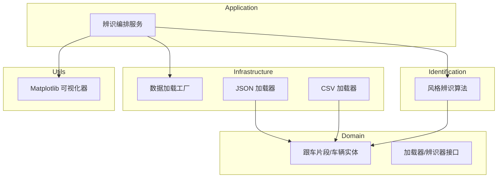

# DriveStyle 项目维基

欢迎来到 **DriveStyle** 项目！本项目提供了一个优雅、模块化且高保真的框架，用于 **跟车驾驶风格辨识 (Car-Following Driving Style Identification)**。

> **核心愿景**：通过物理信息机器学习与多模型假设检验，将原始的车辆运动数据转化为可落地的驾驶意图洞察。

## 🚀 项目概述

DriveStyle 专为自动驾驶研发与交通流研究设计。通过“逆向控制”物理逻辑，即使在存在感知噪声或动态波动的真实工况下，也能精准识别驾驶员的目标跟车时距 (THW)。

### 🌟 核心特性

| 特性 | 详细描述 |
|---------|-------------|
| **多源数据加载** | 采用工厂模式，原生支持 CSV 仿真轨迹与复杂的 JSON 感知片段读取。 |
| **鲁棒片段提取** | 自动识别跟车状态，根据目标 ID 与连续性策略提取高质量的跟车 Clip。 |
| **多模型假设检验** | 反向推演 1.0s, 1.5s, 2.0s 等不同 THW 风格在当前运动学下的理论残差。 |
| **超融合可视化** | 5 面板动力学与决策联合分析图，直观展示速度、距离、加速度、残差演化与判定阶梯。 |
| **批量自动化验证** | 一键执行用例集测试，自动输出混淆矩阵、风格分布与批量 CSV 报表。 |

## 🏗️ 系统架构图

DriveStyle 遵循 **领域驱动设计 (DDD)** 架构，确保代码的高内约与低耦合。



## 📖 导航文档

| 文档名称 | 受众群体 | 核心价值 |
|----------|----------|---------|
| [系统架构设计](./architecture.md) | 架构师 / 核心开发 | 模块化设计、数据流向与 DDD 实践。 |
| [辨识算法模块](./modules/identification.md) | 算法工程师 | 逆向物理残差、多宇宙竞争机制详解。 |
| [快速开始与脚本指南](./getting-started.md) | 用户 / 测试工程师 | 模拟用例生成、单例调试与批量验证 SOP。 |
| [基础设施加载](./modules/infrastructure.md) | 数据工程师 | 扩展自定义 JSON 协议或新数据源指南。 |

## 🛠️ 典型工作流

```python
# 单个 JSON 片段深度辨识与可视化 (生成 5 面合一超融合图)
python3 scripts/run_single_case.py --file debug.json

# 批量执行 tests/ 目录下的所有用例并输出统计报表
python3 scripts/run_batch_cases.py --dir tests/data --plot_limit 5
```

---

*由 [Mini-Wiki v3.0.6](https://github.com/trsoliu/mini-wiki) 自动生成 | 2026-03-14*
