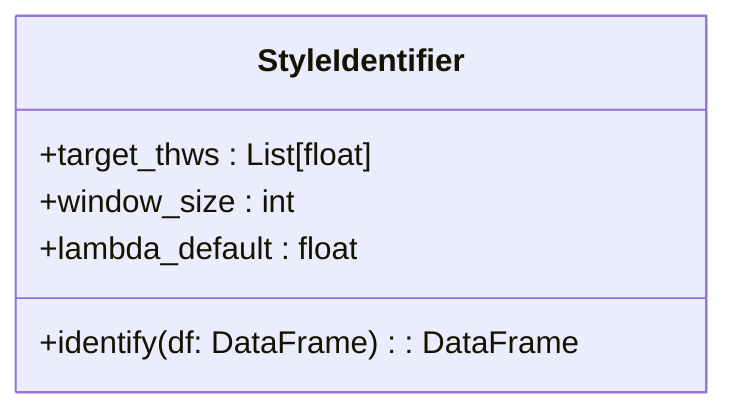

# 辨识算法模块

**辨识算法模块 (Identification Module)** 是 DriveStyle 项目的算法核心。它通过 **基于物理驱动的多假设残差检验 (Reversed-Physics Multi-Hypothesis Testing)** 来推演驾驶员的目标跟车时距 (THW) 风格。

## 🚀 核心理念：“逆向控制器”

在自动驾驶控制中，跟车模型通常基于目标 THW *生成* 加速度。而本辨识器则是 *反向* 这一过程：它观测实际加速度，并判断哪一个“假设的目标 THW”能最好地解释该观测行为。

### 📐 物理建模基础

我们将观测到的自车加速度 $a_{\text{ego}}$ 分解为两个物理分量：
1.  **随动基线力 ($a_{\text{base}}$)**: 仅维持当前状态不改变目标风格所需的力。
2.  **主动纠偏力 ($f_{\text{actual}}$)**: 驾驶员为了缩减或拉大间距以达到其心理预期 THW 的主动意图表现。

推导公式：
$$f_{\text{actual}} = a_{\text{ego}} - \frac{v_{\text{lead}} - v_{\text{ego}}}{\text{THW}_{\text{obs}}}$$

## 🏗️ 多宇宙假设检验策略

算法在三个平行的“候选宇宙”中计算预期纠偏力：
- **激进型宇宙** (目标 THW = 1.0s)
- **标准型宇宙** (目标 THW = 1.5s)
- **保守型宇宙** (目标 THW = 2.0s)

在每个滑动窗口内，算法计算实际纠偏力与各宇宙理想纠偏力之间的 **平均绝对残差 (Residue Cost)**。残差最小的宇宙即被判定为该时段的驾驶风格。

## 📦 核心类：`StyleIdentifier`

`StyleIdentifier` 利用 NumPy 和 Pandas 实现了高效的向量化计算。

### `identify` API 详解
- **输入**: 包含 `timestamp`, `v_ev`, `v_lv`, `dist`, `a_ev` 的 DataFrame。
- **输出**: 包含以下字段的结果 DataFrame：
    - `start_time`, `end_time`: 窗口起止时间。
    - `identified_style`: 辨识出的 THW (如 1.0, 1.5, 2.0)。
    - `cost_1.0`, `cost_1.5`, `cost_2.0`: 各假设下的原始残差值。
    - `valid_ratio`: 意图一致性评分（用于评估结果的可信度）。

## 💡 最佳实践与调优

1.  **窗口长度 (window_size)**: 推荐设置为 100-150 帧 (对于 10Hz 数据，即 10-15s)。较长的窗口能过滤偶然波动，较短的窗口能捕捉风格切换。
2.  **动态步长**: 默认步长取窗口的 1/5。在处理极短片段时，算法会自动减小步长以确保输出足够的连续决策点。
3.  **意图过滤**: 辨识器内部集成了 `valid_ratio` 校验。如果驾驶员的操作在物理语义上与假设意图完全相反（例如太近了还在加速），该点会被标记为不可信。

---

**章节参考源**
- [src/identification/car_following_id.py](file://src/identification/car_following_id.py)

*由 [Mini-Wiki v3.0.6](https://github.com/trsoliu/mini-wiki) 自动生成 | 2026-03-14*
